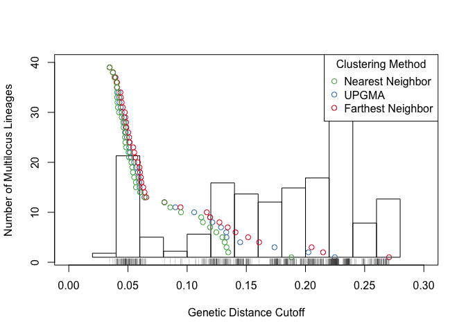
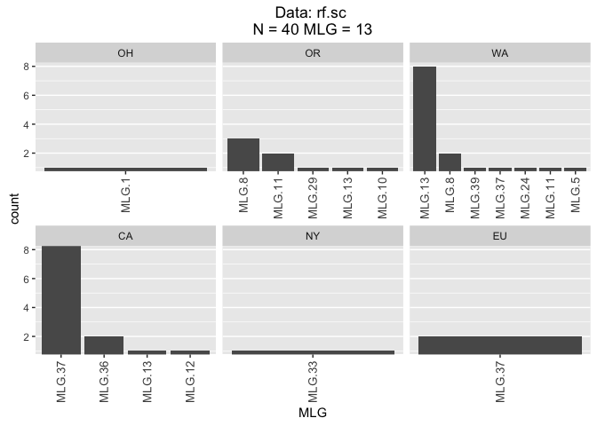
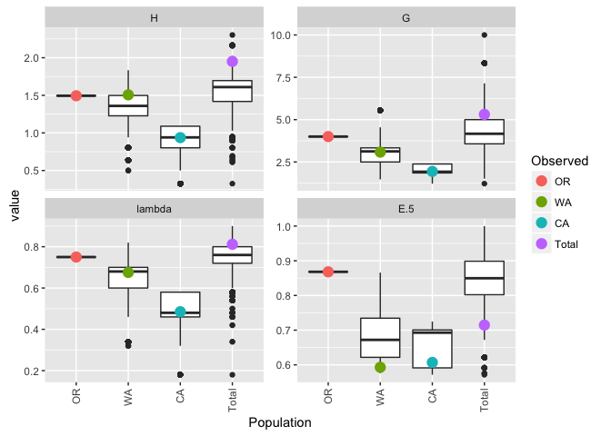
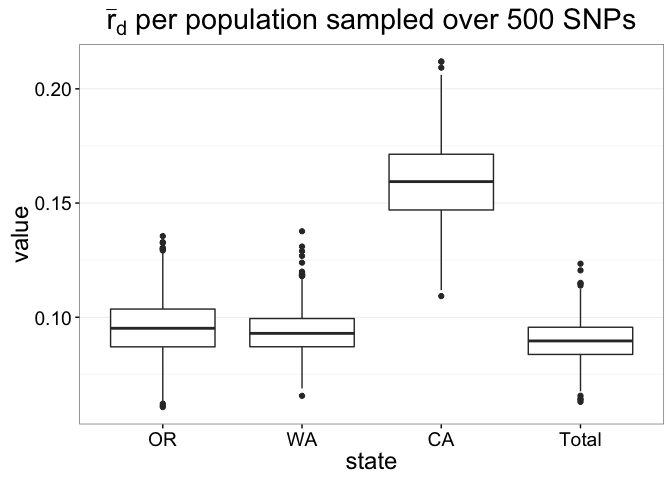
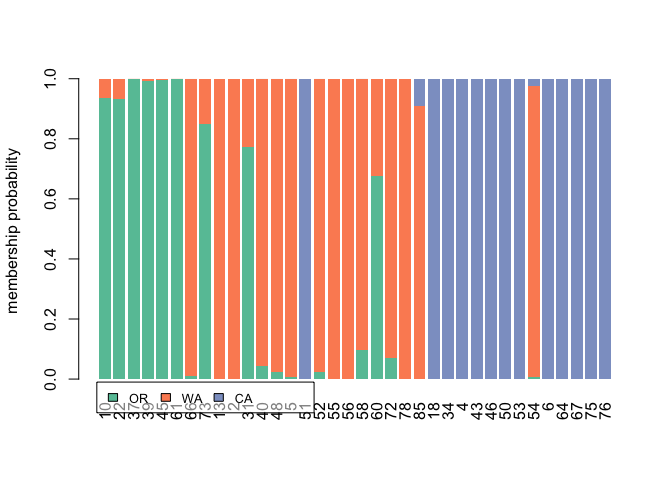

# Example of genomic data in R
Zhian N. Kamvar, Jonah C. Brooks, and Niklaus J. Grünwald  


I've taken the example data from https://github.com/knausb/vcfR_class/ and
ran it through

1. vcf_import.Rmd
2. depth_filtering.Rmd

Now I have the file called `TASSEL_GBS0077_dp_filtered.vcf.gz`. This will be
my starting point.

Data Setup and Import
---------------------


```r
library('ape')
library('vcfR')    # Reading in VCF file and conversion to genlight
library('poppr')   # multilocus genotype and linkage analysis
library('readr')   # reading in tsv file
library('tidyr')   # creating tidy data
library('purrr')   # manipulating lists
library('dplyr')   # manipulating data frames
library('knitr')   # printing tables
library('ggplot2') # plotting cool graphics
rubfrag <- read.vcfR('TASSEL_GBS0077_dp_filtered.vcf.gz', verbose = FALSE)
(rfstrata <- read_tsv("rub_frag_strata.txt"))
```

```
## # A tibble: 40 x 4
##    VCF_ID Country State Nursery
##     <int>   <chr> <chr>   <chr>
## 1      53     USA    CA       F
## 2      50     USA    CA       F
## 3      64     USA    CA       F
## 4      34     USA    CA       F
## 5      46     USA    CA       F
## 6      37     USA    OR       A
## 7      72     USA    WA       J
## 8      66     USA    OR       G
## 9      45     USA    OR       G
## 10     58     USA    WA       I
## # ... with 30 more rows
```

```r
(rf.sc <- rubfrag %>% vcfR2genlight() %>% as.snpclone())
```

```
## Warning in vcfR2genlight(.): Found 907 loci with more than two alleles.
## Objects of class genlight only support loci with two alleles.
## 907 loci will be omitted from the genlight object.
```

```
##  ||| SNPCLONE OBJECT |||||||||
## 
##  || 41 genotypes,  43,414 binary SNPs, size: 3.9 Mb
##  20149 (1.13 %) missing data
## 
##  || Basic content
##    @gen: list of 41 SNPbin
##    @mlg: 41 original multilocus genotypes
##    @ploidy: ploidy of each individual  (range: 2-2)
## 
##  || Optional content
##    @ind.names:  41 individual labels
##    @loc.names:  43414 locus labels
##    @chromosome: factor storing chromosomes of the SNPs
##    @position: integer storing positions of the SNPs
##    @other: a list containing: elements without names
```


Since there are 40 entries in the strata and 41 in the VCF file, we're going
to only include the samples that are present in the strata.


```r
rf.sc <- rf.sc[indNames(rf.sc) %in% rfstrata$VCF_ID, ]
strata(rf.sc) <- rfstrata[match(indNames(rf.sc), rfstrata$VCF_ID), ]
setPop(rf.sc) <- ~State
rf.sc
```

```
##  ||| SNPCLONE OBJECT |||||||||
## 
##  || 40 genotypes,  43,414 binary SNPs, size: 3.9 Mb
##  20007 (1.15 %) missing data
## 
##  || Basic content
##    @gen: list of 40 SNPbin
##    @mlg: 40 original multilocus genotypes
##    @ploidy: ploidy of each individual  (range: 2-2)
## 
##  || Optional content
##    @ind.names:  40 individual labels
##    @loc.names:  43414 locus labels
##    @chromosome: factor storing chromosomes of the SNPs
##    @position: integer storing positions of the SNPs
##    @pop: population of each individual (group size range: 1-15)
##    @strata: a data frame with 4 columns ( VCF_ID, Country, State, Nursery )
##    @other: a list containing: elements without names
```


### Filtering

Because GBS data can't be clone-corrected by default due to various factors,
this step is important. I'm filtering multilocus genotypes by degree of
similarity. The `filter_stats()` function allows me to do this over all three
algorithms across all distance thresholds. I use the output of that function
to pass to the cutoff predictor which will find the largest gap in the data
and create a cutoff within that gap.


```r
rf.filter <- filter_stats(rf.sc, plot = TRUE)
rug(bitwise.dist(rf.sc, percent = TRUE), col = "#4D4D4D80")
```

<!-- -->

```r
# predict cutoff for each algorithm
rf.cutoff <- rf.filter %>%
  transpose() %>%        # Transpose the data
  as_data_frame() %>%    # into a data frame and then
  select(THRESHOLDS) %>% # get the thresholds,
  flatten() %>%          # flatten to a list of nearest, farthest, and average and
  map_dbl(cutoff_predictor, 0.75)  # calculate the cutoff for
rf.cutoff
```

```
##   farthest    average    nearest 
## 0.07313885 0.07241328 0.07241328
```


Now that we have the cutoff set, I can filter the data.


```r
mlg.filter(rf.sc) <- rf.cutoff["farthest"]
rf.sc
```

```
##  ||| SNPCLONE OBJECT |||||||||
## 
##  || 40 genotypes,  43,414 binary SNPs, size: 3.9 Mb
##  20007 (1.15 %) missing data
## 
##  || Basic content
##    @gen: list of 40 SNPbin
##    @mlg: 13 contracted multilocus genotypes
##          (0.073) [t], (bitwise.dist) [d], (farthest) [a]
##    @ploidy: ploidy of each individual  (range: 2-2)
## 
##  || Optional content
##    @ind.names:  40 individual labels
##    @loc.names:  43414 locus labels
##    @chromosome: factor storing chromosomes of the SNPs
##    @position: integer storing positions of the SNPs
##    @pop: population of each individual (group size range: 1-15)
##    @strata: a data frame with 4 columns ( VCF_ID, Country, State, Nursery )
##    @other: a list containing: elements without names
```


To get a sense of the distribution of the MLGs, we should create a table


```r
rf.tab <- mlg.table(rf.sc)
```

<!-- -->


To avoid issues with other analyses, we'll stick to the OR, WA, and CA
populations since they have more than 2 individuals.


```r
rf.cow <- popsub(rf.sc, sublist = c("OR", "WA", "CA"))
```


Diveristy analysis
------------------

We'll do an analysis of genotypic diversity for our populations using the
function `diversity_ci()`. It should be noted that the confidence intervals
are adjusted.


```r
rf.div <- diversity_ci(rf.cow, n = 1e4,
                       parallel = "multicore", ncpus = 4L, raw = FALSE)
```

```
## 
## Confidence Intervals have been centered around observed statistic.
## Please see ?diversity_ci for details.
```

```
## Warning: Removed 75 rows containing non-finite values (stat_boxplot).
```

```
## Warning: Removed 2 rows containing missing values (geom_errorbar).
```

<!-- -->

```r
kable(rf.div, digits = 2)
```

            H   H.est  H.ci                 G   G.est  G.ci              lambda   lambda.est  lambda.ci          E.5   E.5.est  E.5.ci         
------  -----  ------  ---------------  -----  ------  ---------------  -------  -----------  ---------------  -----  --------  ---------------
OR       1.49    1.20  (1.041, 1.948)    4.00    3.10  (2.564, 5.436)      0.75         0.66  (0.566, 0.934)    0.87      0.86  NA             
WA       1.51    1.28  (0.99, 2.024)     3.08    2.97  (1.36, 4.804)       0.68         0.63  (0.456, 0.895)    0.59      0.70  (0.391, 0.795) 
CA       0.94    0.81  (0.442, 1.432)    1.94    1.93  (0.97, 2.915)       0.49         0.45  (0.213, 0.757)    0.61      0.69  NA             
Total    1.95    1.79  (1.646, 2.255)    5.31    4.87  (3.681, 6.942)      0.81         0.79  (0.739, 0.884)    0.71      0.76  (0.604, 0.825) 


We can also do a rarefaction of these stats.


```r
rf.rare <- diversity_ci(rf.cow, n = 1e4, rarefy = TRUE,
                        parallel = "multicore", ncpus = 4L, raw = FALSE)
```

```
## 
## Samples for rarefaction: 10
```

<!-- -->

```r
kable(rf.rare, digits = 2)
```

            H   H.est  H.ci                 G   G.est  G.ci              lambda   lambda.est  lambda.ci        E.5   E.5.est  E.5.ci         
------  -----  ------  ---------------  -----  ------  ---------------  -------  -----------  -------------  -----  --------  ---------------
OR       1.49    1.49  NA                4.00    4.00  NA                  0.75         0.75  NA              0.87      0.87  NA             
WA       1.51    1.34  (0.94, 1.748)     3.08    3.06  (1.923, 4.545)      0.68         0.65  (0.48, 0.78)    0.59      0.69  (0.591, 0.792) 
CA       0.94    0.88  (0.5, 1.089)      1.94    1.95  (1.471, 2.381)      0.49         0.47  (0.32, 0.58)    0.61      0.65  (0.576, 0.725) 
Total    1.95    1.55  (1.089, 2.025)    5.31    4.29  (2.381, 7.143)      0.81         0.75  (0.58, 0.86)    0.71      0.85  (0.672, 0.947) 


Index of Association ($\bar{r}_d$)
----------------------------------

The index of association can tell us how clonal these populations appear. We
have the option of either doing a sliding window or a random sampling of
SNPs. Since the sliding window assumes contiguous chromosomes, and we have
43,414 contigs, it would be
best to conduct a sampling analysis.

Here I've chosen to do **1000** replicates with **500** SNPs for each
population and the total data set.


```r
set.seed(20160718)
rf.ia <- seppop(rf.cow) %>% # separate each population
  c(Total = rf.cow) %>%     # add the total population
  lapply(samp.ia, threads = 0, n.snp = 500L, reps = 1000L) %>%
  data.frame %>%    # convert list to data frame w/ 1000 rows
  gather(state, value) # convert to long, tidy data
```


```r
head(rf.ia)
```

```
##   state      value
## 1    OR 0.09931291
## 2    OR 0.09132808
## 3    OR 0.12003242
## 4    OR 0.08546839
## 5    OR 0.08824280
## 6    OR 0.09850253
```

```r
ggplot(rf.ia, aes(x = state, y = value)) +
  geom_boxplot() +
  theme_bw() +
  theme(panel.grid.major.x = element_blank()) +
  theme(text = element_text(size = 18)) +
  ggtitle(expression(paste(bar(r)[d], " per population sampled over 500 SNPs")))
```

<!-- -->


Minimum Spanning Network
------------------------


```r
rf.cow_dist <- bitwise.dist(rf.cow, percent = TRUE, mat = FALSE,
                            missing_match = TRUE, differences_only = FALSE,
                            threads = 0)
min_span_net <- poppr.msn(rf.cow, rf.cow_dist, showplot = FALSE,
                          include.ties = TRUE,
                          threshold = rf.cutoff["farthest"],
                          clustering.algorithm = "farthest")

set.seed(70)
PAL <- setNames(RColorBrewer::brewer.pal(3, "Set2"), popNames(rf.cow))
plot_poppr_msn(rf.cow,
               min_span_net,
               inds = "none",
               mlg = TRUE,
               gadj = 6,
               nodebase = 1.15,
               palette = PAL,
               cutoff = NULL,
               quantiles = FALSE,
               beforecut = TRUE,
               vertex.label.font = 2)
```

<!-- -->


Discriminant Analysis of Principle Components
---------------------------------------------


```r
rf.dapc <- dapc(rf.cow[order(pop(rf.cow))], n.pca = 12, n.da = 2)
```


```r
scatter.dapc(rf.dapc, col = PAL)
```

<!-- -->

```r
compoplot(rf.dapc, col = PAL)
```

<!-- -->

Session Information
===================


```r
options(width = 100)
devtools::session_info()
```

```
## Session info ---------------------------------------------------------------------------------------
```

```
##  setting  value                       
##  version  R version 3.3.1 (2016-06-21)
##  system   x86_64, darwin13.4.0        
##  ui       X11                         
##  language (EN)                        
##  collate  en_US.UTF-8                 
##  tz       America/Los_Angeles         
##  date     2016-07-19
```

```
## Packages -------------------------------------------------------------------------------------------
```

```
##  package      * version     date       source                          
##  ade4         * 1.7-4       2016-03-01 CRAN (R 3.2.3)                  
##  adegenet     * 2.0.1       2016-02-15 CRAN (R 3.3.0)                  
##  ape          * 3.5         2016-05-24 CRAN (R 3.3.0)                  
##  assertthat     0.1         2013-12-06 CRAN (R 3.2.0)                  
##  boot           1.3-18      2016-02-23 CRAN (R 3.2.3)                  
##  cluster        2.0.4       2016-04-18 CRAN (R 3.3.0)                  
##  coda           0.18-1      2015-10-16 CRAN (R 3.2.0)                  
##  codetools      0.2-14      2015-07-15 CRAN (R 3.2.0)                  
##  colorspace     1.2-6       2015-03-11 CRAN (R 3.2.0)                  
##  DBI            0.4-1       2016-05-08 CRAN (R 3.3.0)                  
##  deldir         0.1-12      2016-03-06 CRAN (R 3.2.4)                  
##  devtools       1.12.0      2016-06-24 CRAN (R 3.3.0)                  
##  digest         0.6.9       2016-01-08 CRAN (R 3.2.3)                  
##  dplyr        * 0.5.0       2016-06-24 CRAN (R 3.3.0)                  
##  evaluate       0.9         2016-04-29 CRAN (R 3.2.5)                  
##  fastmatch      1.0-4       2012-01-21 CRAN (R 3.2.0)                  
##  formatR        1.4         2016-05-09 CRAN (R 3.3.0)                  
##  gdata          2.17.0      2015-07-04 CRAN (R 3.2.0)                  
##  ggplot2      * 2.1.0       2016-03-01 CRAN (R 3.3.0)                  
##  gmodels        2.16.2      2015-07-22 CRAN (R 3.2.0)                  
##  gtable         0.2.0       2016-02-26 CRAN (R 3.2.3)                  
##  gtools         3.5.0       2015-05-29 CRAN (R 3.2.0)                  
##  highr          0.6         2016-05-09 CRAN (R 3.3.0)                  
##  htmltools      0.3.5       2016-03-21 CRAN (R 3.2.4)                  
##  httpuv         1.3.3       2015-08-04 CRAN (R 3.2.0)                  
##  igraph         1.0.1       2015-06-26 CRAN (R 3.2.0)                  
##  knitr        * 1.13        2016-05-09 CRAN (R 3.3.0)                  
##  labeling       0.3         2014-08-23 CRAN (R 3.2.0)                  
##  lattice        0.20-33     2015-07-14 CRAN (R 3.2.0)                  
##  lazyeval       0.2.0.9000  2016-07-01 Github (hadley/lazyeval@c155c3d)
##  LearnBayes     2.15        2014-05-29 CRAN (R 3.2.0)                  
##  magrittr       1.5         2014-11-22 CRAN (R 3.2.0)                  
##  MASS           7.3-45      2015-11-10 CRAN (R 3.2.2)                  
##  Matrix         1.2-6       2016-05-02 CRAN (R 3.3.0)                  
##  memoise        1.0.0       2016-01-29 CRAN (R 3.2.3)                  
##  memuse         2.5         2015-07-02 CRAN (R 3.2.0)                  
##  mgcv           1.8-12      2016-03-03 CRAN (R 3.2.4)                  
##  mime           0.5         2016-07-07 cran (@0.5)                     
##  munsell        0.4.3       2016-02-13 CRAN (R 3.2.3)                  
##  nlme           3.1-128     2016-05-10 CRAN (R 3.3.0)                  
##  nnls           1.4         2012-03-19 CRAN (R 3.2.0)                  
##  pegas          0.9         2016-04-16 CRAN (R 3.2.5)                  
##  permute        0.9-0       2016-01-24 CRAN (R 3.2.3)                  
##  phangorn       2.0.3       2016-05-01 CRAN (R 3.2.5)                  
##  pinfsc50       1.0.0       2016-01-29 CRAN (R 3.2.3)                  
##  plyr           1.8.4       2016-06-08 CRAN (R 3.3.0)                  
##  poppr        * 2.2.0       2016-06-13 CRAN (R 3.3.1)                  
##  purrr        * 0.2.2       2016-06-18 CRAN (R 3.3.0)                  
##  quadprog       1.5-5       2013-04-17 CRAN (R 3.2.0)                  
##  R6             2.1.2       2016-01-26 CRAN (R 3.2.3)                  
##  RColorBrewer   1.1-2       2014-12-07 CRAN (R 3.2.0)                  
##  Rcpp           0.12.5      2016-05-14 CRAN (R 3.3.0)                  
##  readr        * 0.2.2       2015-10-22 CRAN (R 3.2.0)                  
##  reshape2       1.4.1       2014-12-06 CRAN (R 3.2.0)                  
##  rmarkdown      1.0         2016-07-08 cran (@1.0)                     
##  scales         0.4.0       2016-02-26 CRAN (R 3.2.3)                  
##  seqinr         3.1-5       2016-06-08 CRAN (R 3.3.0)                  
##  shiny          0.13.2.9004 2016-06-23 Github (rstudio/shiny@bf52075)  
##  sp             1.2-3       2016-04-14 CRAN (R 3.3.0)                  
##  spdep          0.6-5       2016-06-02 CRAN (R 3.3.0)                  
##  stringi        1.1.1       2016-05-27 CRAN (R 3.3.0)                  
##  stringr        1.0.0       2015-04-30 CRAN (R 3.2.0)                  
##  tibble         1.1         2016-07-04 CRAN (R 3.3.0)                  
##  tidyr        * 0.5.1       2016-06-14 cran (@0.5.1)                   
##  vcfR         * 1.1.0.9000  2016-07-19 Github (knausb/vcfR@4dd2d13)    
##  vegan          2.3-5       2016-04-09 CRAN (R 3.2.4)                  
##  viridisLite    0.1.3       2016-03-12 CRAN (R 3.2.4)                  
##  withr          1.0.2       2016-06-20 cran (@1.0.2)                   
##  xtable         1.8-2       2016-02-05 CRAN (R 3.2.3)                  
##  yaml           2.1.13      2014-06-12 CRAN (R 3.2.0)
```


---
title: "genomic_data.R"
author: "zhian"
date: "Tue Jul 19 14:44:35 2016"
---
