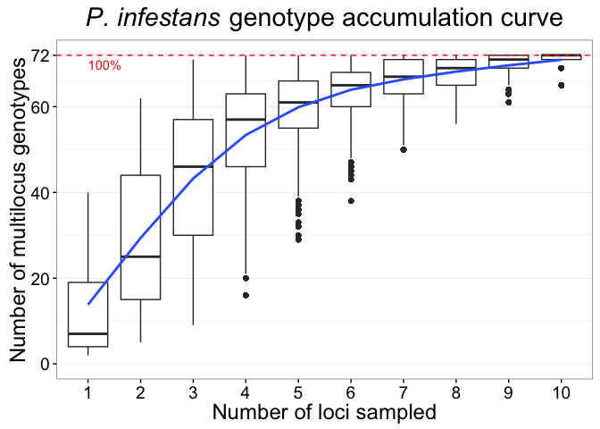
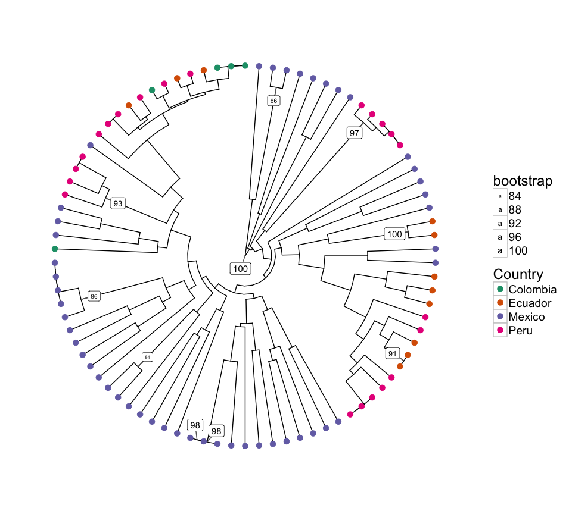
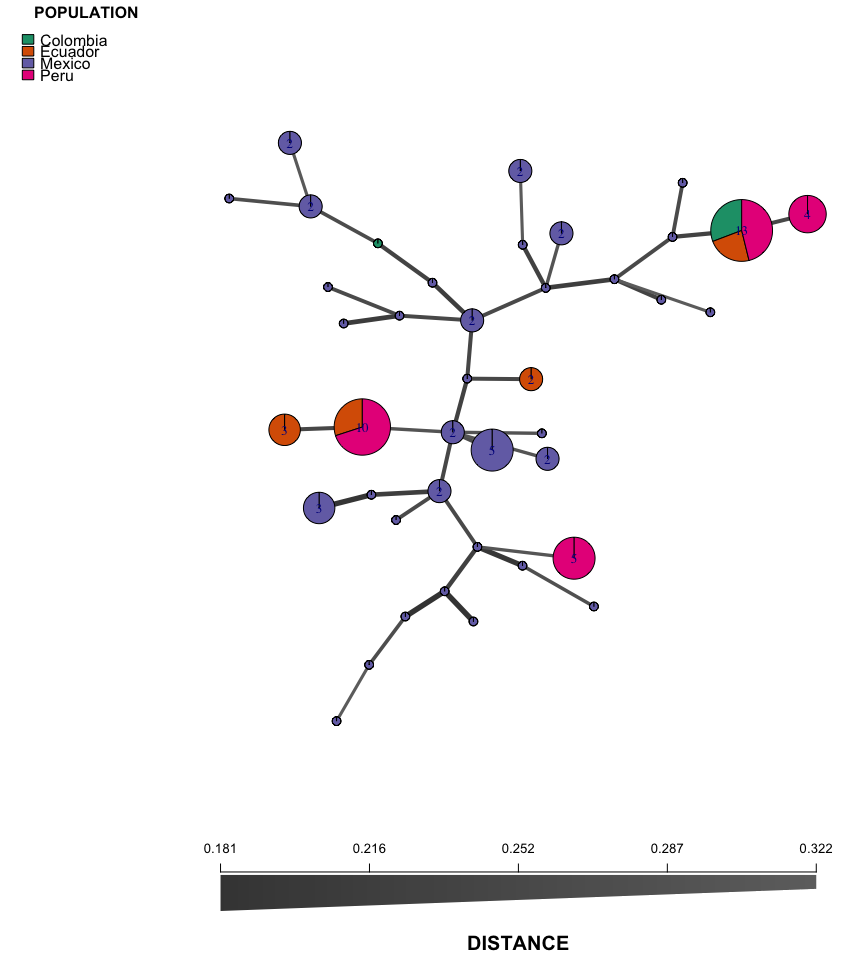

# Example of polyploid, clonal, microsatellite data in R
Zhian N. Kamvar, Jonah C. Brooks, and Niklaus J. Grünwald  

The purpose of this analysis is to investigate the population structure of
*Phytophthora infestans* from North America and South America using the data
from Goss *et al.*, 2014.

Data Setup and Import
---------------------


```r
library('poppr')
```

```
## Loading required package: adegenet
```

```
## Loading required package: ade4
```

```
## 
##    /// adegenet 2.0.1 is loaded ////////////
## 
##    > overview: '?adegenet'
##    > tutorials/doc/questions: 'adegenetWeb()' 
##    > bug reports/feature requests: adegenetIssues()
```

```
## This is poppr version 2.2.0. To get started, type package?poppr
## OMP parallel support: available
```

```r
library('purrr')
library('dplyr')
```

```
## 
## Attaching package: 'dplyr'
```

```
## The following objects are masked from 'package:purrr':
## 
##     contains, order_by
```

```
## The following objects are masked from 'package:stats':
## 
##     filter, lag
```

```
## The following objects are masked from 'package:base':
## 
##     intersect, setdiff, setequal, union
```

```r
library('ggplot2')
library('RColorBrewer')
data(Pinf)
Pinf <- Pinf %>%
  recode_polyploids(newploidy = TRUE)
pinfreps <- c(Pi02 = 2, D13 = 2, Pi33 = 6, Pi04 = 2, Pi4B = 2, Pi16 = 2,
              G11 = 2, Pi56 = 2, Pi63 = 3, Pi70 = 3, Pi89 = 2)
pinfreps <- fix_replen(Pinf, pinfreps)
Pinf
```

```
## 
## This is a genclone object
## -------------------------
## Genotype information:
## 
##    72 multilocus genotypes 
##    86 diploid (55) and triploid (31) individuals
##    11 codominant loci
## 
## Population information:
## 
##     2 strata - Continent Country
##     2 populations defined - South America North America
```

```r
ContinentPAL <- setNames(c("firebrick", "blue"), popNames(Pinf))
setPop(Pinf) <- ~Country
CountryPAL   <- setNames(RColorBrewer::brewer.pal(4, "Set3"), popNames(Pinf))
```


One of the first things to do in an analysis of microsatellite data is to
ensure that the we have provide enough information to accurately call
multilocus genotypes.


```r
genotype_curve(Pinf, sample = 1e4)
```

```r
gcp <- last_plot()
```


```r
gcp +
  theme_bw() +
  geom_smooth(aes(group = 1)) +
  theme(text = element_text(size = 18)) +
  theme(panel.grid.major.x = element_blank()) +
  ggtitle(expression(paste(italic("P. infestans"), " genotype accumulation curve")))
```

<!-- -->

The data that we have is mixed diploid and polyploid microsatellite markers.
This means that we should use Bruvo's distance, which accounts for ploidy.
Here, I'm using the genome addition model to calculate the distance. First,
I'm going to filter the multilocus genotypes.


```r
pinf.bd     <- bruvo.dist(Pinf, replen = pinfreps, add = TRUE, loss = FALSE)
pinf.filter <- filter_stats(Pinf, dist = pinf.bd, plot = TRUE)
rug(pinf.bd, col = "#4D4D4D80")
```

<!-- -->

```r
pinf.cutoff <- pinf.filter %>%
  transpose() %>%        # Transpose the data
  as_data_frame() %>%    # into a data frame and then
  select(THRESHOLDS) %>% # get the thresholds,
  flatten() %>%          # flatten to a list of nearest, farthest, and average and
  map_dbl(cutoff_predictor)  # calculate the cutoff for

mlg.filter(Pinf, dist = bruvo.dist, replen = pinfreps, loss = FALSE) <- pinf.cutoff["farthest"]
Pinf
```

```
## 
## This is a genclone object
## -------------------------
## Genotype information:
## 
##    41 contracted multilocus genotypes
##       (0.17) [t], (bruvo.dist) [d], (farthest) [a] 
##    86 diploid (55) and triploid (31) individuals
##    11 codominant loci
## 
## Population information:
## 
##     2 strata - Continent Country
##     4 populations defined - Colombia Ecuador Mexico Peru
```


Minimum Spanning Network
------------------------

I'm using the filtered genotypes for this analysis.


```r
fmin_span_net <- bruvo.msn(Pinf, replen = pinfreps, add = TRUE, loss = FALSE,
                          showplot = FALSE,
                          include.ties = TRUE,
                          threshold = pinf.cutoff["farthest"],
                          clustering.algorithm = "farthest_neighbor")
set.seed(69)
plot_poppr_msn(Pinf,
               fmin_span_net,
               inds = "none",
               mlg = FALSE,
               gadj = 2,
               nodebase = 1.15,
               palette = CountryPAL,
               cutoff = NULL,
               quantiles = FALSE,
               beforecut = TRUE,
               layfun = igraph::layout_with_kk)
```

<!-- -->

Here's the original network


```r
mll(Pinf) <- "original"
min_span_net <- bruvo.msn(Pinf, replen = pinfreps, add = TRUE, loss = FALSE,
                          showplot = FALSE,
                          include.ties = TRUE)
set.seed(69)
plot_poppr_msn(Pinf,
               min_span_net,
               inds = "none",
               mlg = FALSE,
               gadj = 2,
               nodebase = 1.15,
               palette = CountryPAL,
               cutoff = NULL,
               quantiles = FALSE,
               beforecut = TRUE,
               layfun = igraph::layout_with_kk)
```

<!-- -->

Session Information
===================


```r
if (!interactive()) options(width = 100)
devtools::session_info()
```

```
## Session info ---------------------------------------------------------------------------------------
```

```
##  setting  value                       
##  version  R version 3.3.1 (2016-06-21)
##  system   x86_64, darwin13.4.0        
##  ui       X11                         
##  language (EN)                        
##  collate  en_US.UTF-8                 
##  tz       America/Los_Angeles         
##  date     2016-07-20
```

```
## Packages -------------------------------------------------------------------------------------------
```

```
##  package      * version     date       source                          
##  ade4         * 1.7-4       2016-03-01 CRAN (R 3.2.3)                  
##  adegenet     * 2.0.1       2016-02-15 CRAN (R 3.3.0)                  
##  ape            3.5         2016-05-24 CRAN (R 3.3.0)                  
##  assertthat     0.1         2013-12-06 CRAN (R 3.2.0)                  
##  boot           1.3-18      2016-02-23 CRAN (R 3.2.3)                  
##  cluster        2.0.4       2016-04-18 CRAN (R 3.3.0)                  
##  coda           0.18-1      2015-10-16 CRAN (R 3.2.0)                  
##  colorspace     1.2-6       2015-03-11 CRAN (R 3.2.0)                  
##  DBI            0.4-1       2016-05-08 CRAN (R 3.3.0)                  
##  deldir         0.1-12      2016-03-06 CRAN (R 3.2.4)                  
##  devtools       1.12.0      2016-06-24 CRAN (R 3.3.0)                  
##  digest         0.6.9       2016-01-08 CRAN (R 3.2.3)                  
##  dplyr        * 0.5.0       2016-06-24 CRAN (R 3.3.0)                  
##  evaluate       0.9         2016-04-29 CRAN (R 3.2.5)                  
##  fastmatch      1.0-4       2012-01-21 CRAN (R 3.2.0)                  
##  formatR        1.4         2016-05-09 CRAN (R 3.3.0)                  
##  gdata          2.17.0      2015-07-04 CRAN (R 3.2.0)                  
##  ggplot2      * 2.1.0       2016-03-01 CRAN (R 3.3.0)                  
##  gmodels        2.16.2      2015-07-22 CRAN (R 3.2.0)                  
##  gtable         0.2.0       2016-02-26 CRAN (R 3.2.3)                  
##  gtools         3.5.0       2015-05-29 CRAN (R 3.2.0)                  
##  htmltools      0.3.5       2016-03-21 CRAN (R 3.2.4)                  
##  httpuv         1.3.3       2015-08-04 CRAN (R 3.2.0)                  
##  igraph         1.0.1       2015-06-26 CRAN (R 3.2.0)                  
##  knitr          1.13        2016-05-09 CRAN (R 3.3.0)                  
##  lattice        0.20-33     2015-07-14 CRAN (R 3.2.0)                  
##  lazyeval       0.2.0.9000  2016-07-01 Github (hadley/lazyeval@c155c3d)
##  LearnBayes     2.15        2014-05-29 CRAN (R 3.2.0)                  
##  magrittr       1.5         2014-11-22 CRAN (R 3.2.0)                  
##  MASS           7.3-45      2015-11-10 CRAN (R 3.2.2)                  
##  Matrix         1.2-6       2016-05-02 CRAN (R 3.3.0)                  
##  memoise        1.0.0       2016-01-29 CRAN (R 3.2.3)                  
##  mgcv           1.8-12      2016-03-03 CRAN (R 3.2.4)                  
##  mime           0.5         2016-07-07 cran (@0.5)                     
##  munsell        0.4.3       2016-02-13 CRAN (R 3.2.3)                  
##  nlme           3.1-128     2016-05-10 CRAN (R 3.3.0)                  
##  nnls           1.4         2012-03-19 CRAN (R 3.2.0)                  
##  pegas          0.9         2016-04-16 CRAN (R 3.2.5)                  
##  permute        0.9-0       2016-01-24 CRAN (R 3.2.3)                  
##  phangorn       2.0.4       2016-06-21 CRAN (R 3.3.0)                  
##  plyr           1.8.4       2016-06-08 CRAN (R 3.3.0)                  
##  poppr        * 2.2.0       2016-06-13 CRAN (R 3.3.1)                  
##  purrr        * 0.2.2       2016-06-18 CRAN (R 3.3.0)                  
##  quadprog       1.5-5       2013-04-17 CRAN (R 3.2.0)                  
##  R6             2.1.2       2016-01-26 CRAN (R 3.2.3)                  
##  RColorBrewer * 1.1-2       2014-12-07 CRAN (R 3.2.0)                  
##  Rcpp           0.12.6      2016-07-19 CRAN (R 3.3.0)                  
##  reshape2       1.4.1       2014-12-06 CRAN (R 3.2.0)                  
##  rmarkdown      1.0         2016-07-08 cran (@1.0)                     
##  scales         0.4.0       2016-02-26 CRAN (R 3.2.3)                  
##  seqinr         3.3-0       2016-07-19 CRAN (R 3.3.0)                  
##  shiny          0.13.2.9004 2016-06-23 Github (rstudio/shiny@bf52075)  
##  sp             1.2-3       2016-04-14 CRAN (R 3.3.0)                  
##  spdep          0.6-5       2016-06-02 CRAN (R 3.3.0)                  
##  stringi        1.1.1       2016-05-27 CRAN (R 3.3.0)                  
##  stringr        1.0.0       2015-04-30 CRAN (R 3.2.0)                  
##  tibble         1.1         2016-07-04 CRAN (R 3.3.0)                  
##  vegan          2.4-0       2016-06-15 CRAN (R 3.3.0)                  
##  withr          1.0.2       2016-06-20 cran (@1.0.2)                   
##  xtable         1.8-2       2016-02-05 CRAN (R 3.2.3)                  
##  yaml           2.1.13      2014-06-12 CRAN (R 3.2.0)
```


---
title: "microsatellite_data.R"
author: "zhian"
date: "Wed Jul 20 11:48:49 2016"
---
